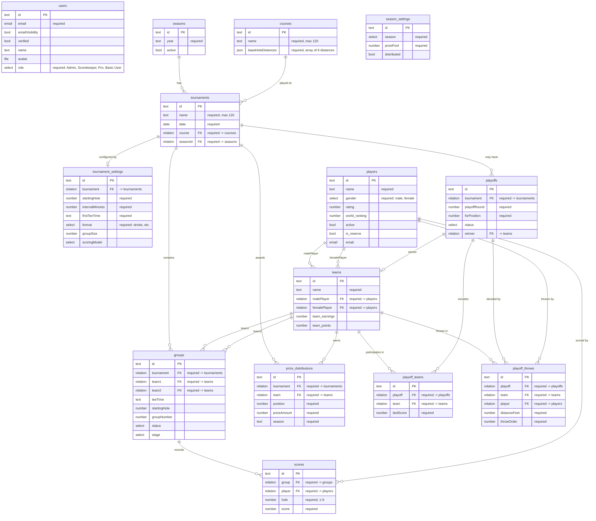

# Database Schema

```mermaid
erDiagram
    users {
        text id PK
        email email "required"
        bool emailVisibility
        bool verified
        text name
        file avatar
        select role "required: Admin, Scorekeeper, Pro, Basic User"
    }

    seasons {
        text id PK
        text year "required"
        bool active
    }

    courses {
        text id PK
        text name "required, max 120"
        json baseHoleDistances "required, array of 9 distances"
    }

    tournaments {
        text id PK
        text name "required, max 120"
        date date "required"
        relation course FK "required -> courses"
        relation seasonId FK "required -> seasons"
    }

    tournament_settings {
        text id PK
        relation tournament FK "-> tournaments"
        number startingHole "required"
        number intervalMinutes "required"
        text firstTeeTime "required"
        select format "required: stroke, etc."
        number groupSize
        select scoringModel
    }

    players {
        text id PK
        text name "required"
        select gender "required: male, female"
        number rating
        number world_ranking
        bool active
        bool is_reserve
        email email
    }

    teams {
        text id PK
        text name "required"
        relation malePlayer FK "required -> players"
        relation femalePlayer FK "required -> players"
        number team_earnings
        number team_points
    }

    groups {
        text id PK
        relation tournament FK "required -> tournaments"
        relation team1 FK "required -> teams"
        relation team2 FK "required -> teams"
        text teeTime
        number startingHole
        number groupNumber
        select status
        select stage
    }

    scores {
        text id PK
        relation group FK "required -> groups"
        relation player FK "required -> players"
        number hole "required, 1-9"
        number score "required"
    }

    season_settings {
        text id PK
        select season "required"
        number prizePool "required"
        bool distributed
    }

    prize_distributions {
        text id PK
        relation tournament FK "required -> tournaments"
        relation team FK "required -> teams"
        number position "required"
        number prizeAmount "required"
        text season "required"
    }

    playoffs {
        text id PK
        relation tournament FK "required -> tournaments"
        number playoffRound "required"
        number forPosition "required"
        select status
        relation winner FK "-> teams"
    }

    playoff_teams {
        text id PK
        relation playoff FK "required -> playoffs"
        relation team FK "required -> teams"
        number tiedScore "required"
    }

    playoff_throws {
        text id PK
        relation playoff FK "required -> playoffs"
        relation team FK "required -> teams"
        relation player FK "required -> players"
        number distanceFeet "required"
        number throwOrder "required"
    }

    seasons ||--o{ tournaments : "has"
    courses ||--o{ tournaments : "played at"
    tournaments ||--o| tournament_settings : "configured by"
    tournaments ||--o{ groups : "contains"
    tournaments ||--o{ prize_distributions : "awards"
    tournaments ||--o{ playoffs : "may have"

    players ||--o{ teams : "malePlayer"
    players ||--o{ teams : "femalePlayer"

    teams ||--o{ groups : "team1"
    teams ||--o{ groups : "team2"
    teams ||--o{ prize_distributions : "earns"
    teams ||--o{ playoff_teams : "participates in"
    teams ||--o{ playoff_throws : "throws in"

    groups ||--o{ scores : "records"
    players ||--o{ scores : "scored by"

    playoffs ||--o{ playoff_teams : "includes"
    playoffs ||--o{ playoff_throws : "decided by"
    playoffs ||--o| teams : "winner"

    players ||--o{ playoff_throws : "thrown by"
```
